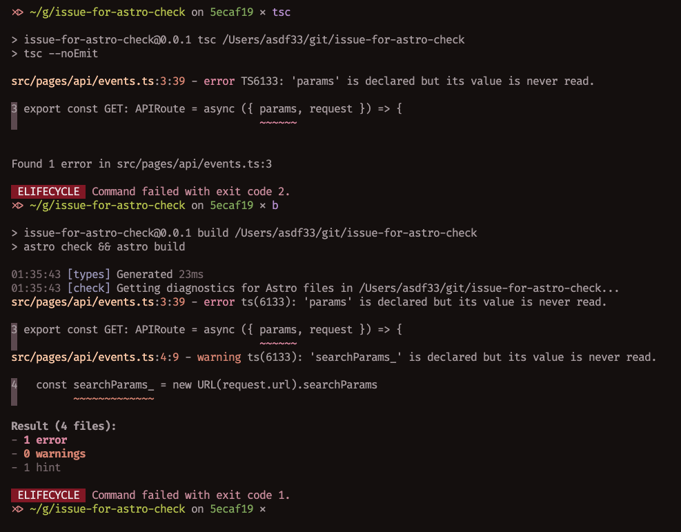
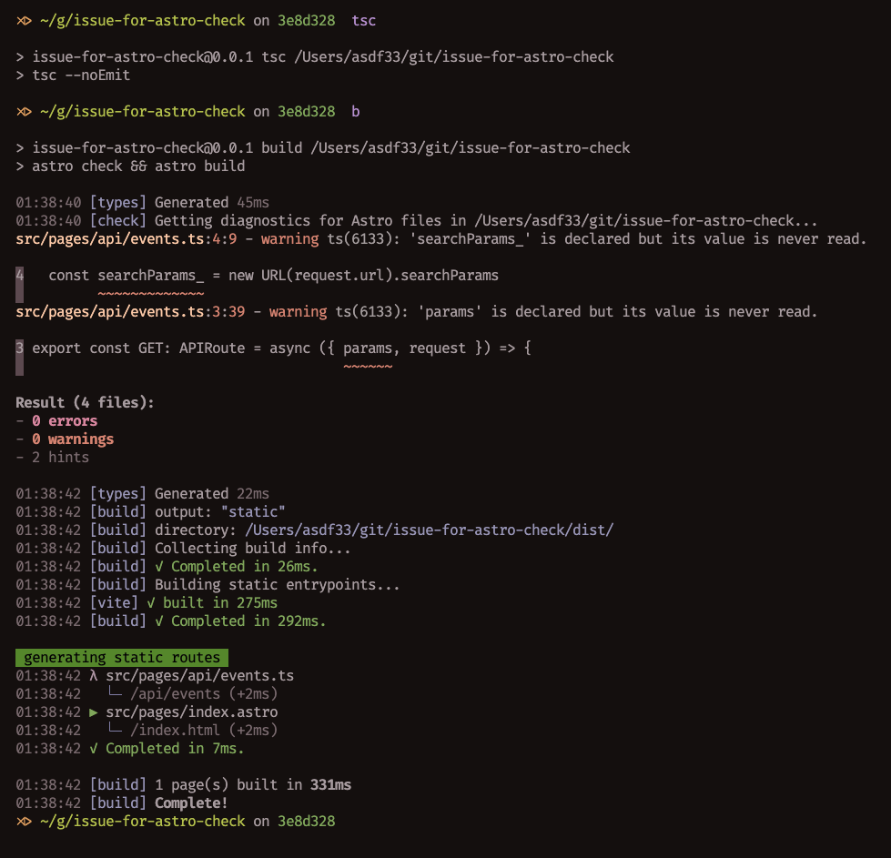

# on commit 5ecaf196 ✅

tsc get errors, as expected

```
{
  "extends": "astro/tsconfigs/strict",
  "compilerOptions": {
    "noUnusedParameters": true
  }
}
```



# on commit 3e8d328d ❓

tsc get 0 error

however, upon executing the "astro check" command, several hints appeared in the console, leading me to mistakenly believe they were genuine compilation errors

> however this issue can be suppressed in the console by utilizing the flag --minimumSeverity warning

```
{
  "extends": "astro/tsconfigs/strict",
  "compilerOptions": {
    "noUnusedParameters": false
  }
}
```


